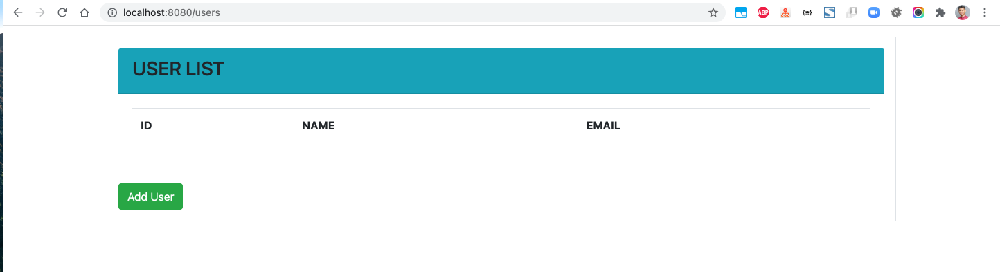
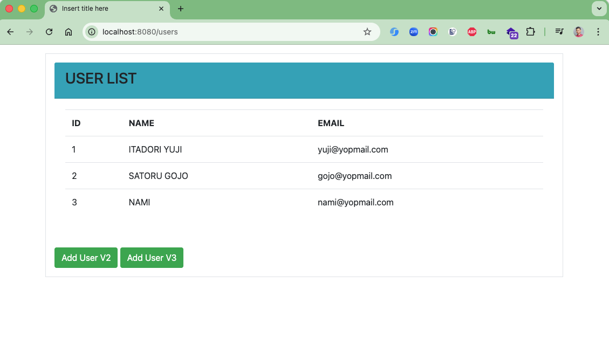
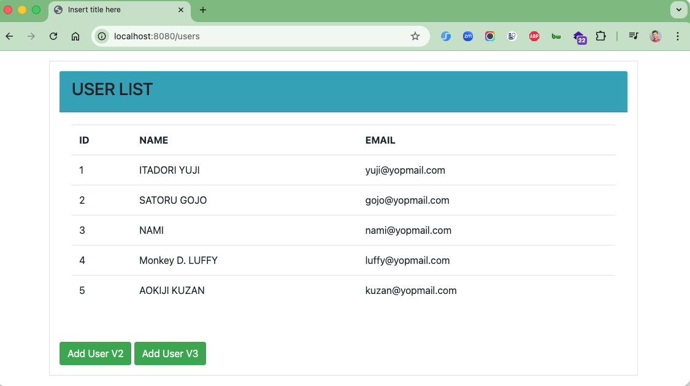
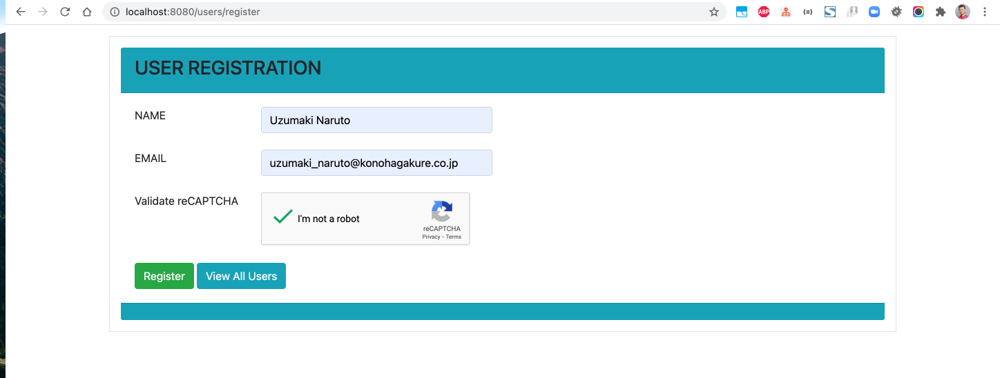
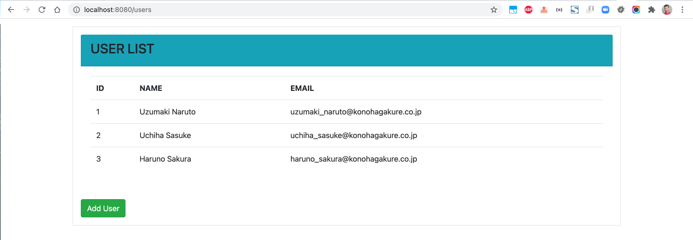
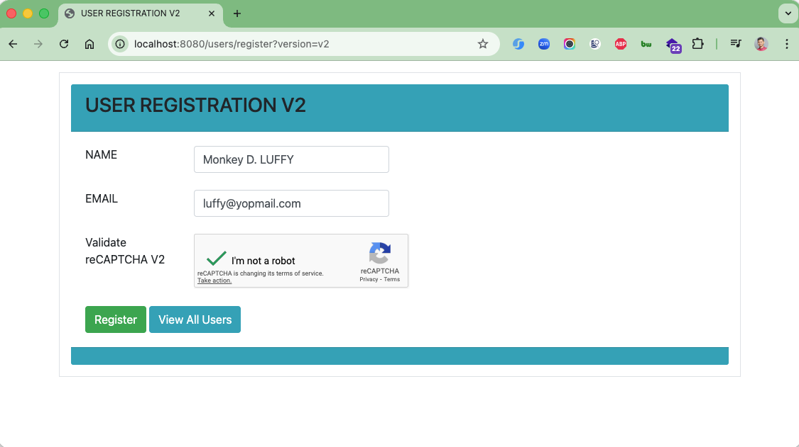
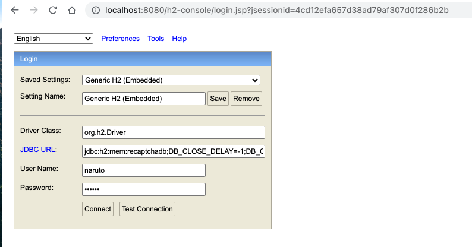
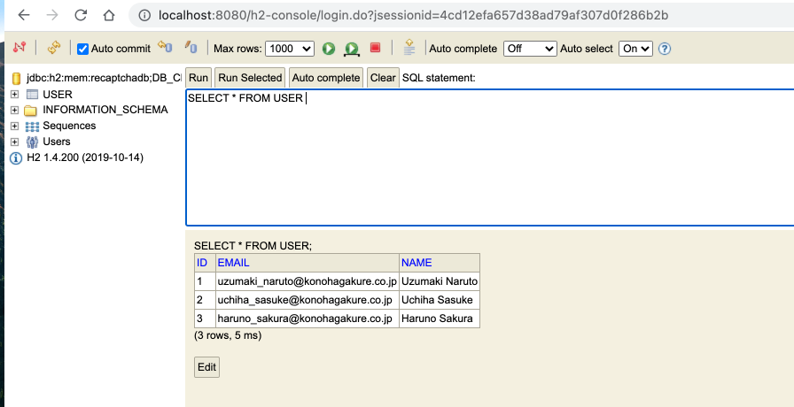

# spring-boot-google-recaptcha

### Things to do list

1. Clone this repository: `git clone https://github.com/hendisantika/spring-boot-google-recaptcha.git`
2. Navigate to the folder: `cd spring-boot-google-recaptcha`
3. Run the application: `mvn clean spring-boot:run`
4. Open your favorite browser: http://localhost:8080/users

### Images Screen shot

Users List Page

User Register Page

H2 Page

Article
Source: https://javatechonline.com/how-to-secure-spring-boot-application-by-google-recaptcha/?fbclid=IwAR3PLUXO425As1XAHFZJLXZEf9gPIUl3GQsR6RE3EnBOkHGwjGizi2FdPsk
